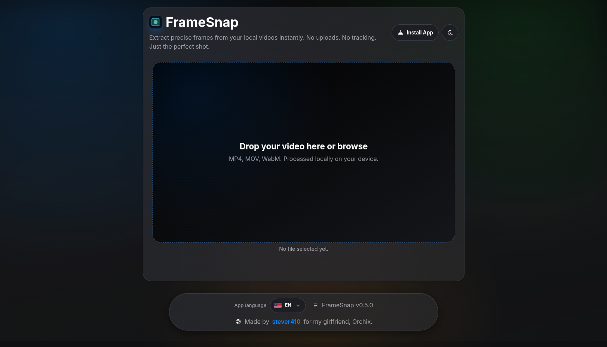

# FrameSnap


Local-first PWA to capture precise frames from local video files.

- No uploads
- No tracking
- Works offline after first load
- iOS-friendly share/download flow

## Features

- Import local video files (`mp4`, `mov`, `webm`, and browser-supported formats)
- Video preview with timestamp input (`mm:ss.xxx`) and seek-on-enter/blur
- Accurate frame capture with optional upscale factors (1x, 1.5x, 2x, 3x)
- Share captured frame (`navigator.share` with file support)
- Download fallback when sharing is unavailable
- Light/dark theme toggle with local persistence
- Locale switching (`en`, `vi`) with localized metadata/manifest
- Installable PWA + service worker shell caching

## Tech Stack

- Preact + TypeScript (strict)
- Vite
- Biome (lint + format validation)
- Vitest + Testing Library (unit/component tests)
- Custom Service Worker (`public/sw.js`)

## Getting Started

### Prerequisites

- Node.js 20+ (recommended for CI parity)
- npm

### Install

```bash
npm install
```

### Run Dev Server

```bash
npm run dev
```

## Scripts

```bash
npm run dev           # start local dev server
npm run build         # typecheck build + vite production build
npm run preview       # preview production build locally
npm run typecheck     # TypeScript checks (no emit)
npm run check         # Biome lint/format validation (no write)
npm run check:write   # apply Biome safe fixes
npm run format        # format files with Biome
npm run lint          # lint files with Biome
npm run test          # run all tests
npm run test:watch    # run tests in watch mode
npm run test:coverage # run tests with coverage report (80% min thresholds)
```

## Testing and Coverage

- Test runner: Vitest (`jsdom`)
- Coverage provider: V8
- Global minimum thresholds are enforced in `vitest.config.ts`:
  - statements: 80%
  - branches: 80%
  - functions: 80%
  - lines: 80%
- HTML coverage report output: `coverage/index.html`

## CI/CD Workflows

Workflows are in `.github/workflows/`:

- `ci-quality.yml`
  - Runs on every pull request and push to `main`
  - Gates: `npm run check`, `npm run typecheck`, `npm run test`
- `deploy-production.yml`
  - Runs on version tags (`v*`) or manual dispatch
  - Re-runs quality gates + build before deploy
  - Deploys to Vercel production
- `release-notes.yml`
  - Handles release tagging/notes for version bumps
  - Now includes the same quality gate before release job

## Production Deployment

Primary target: Vercel.

Required GitHub configuration:

- Secrets:
  - `VERCEL_TOKEN`
- Repository variables:
  - `VERCEL_ORG_ID`
  - `VERCEL_PROJECT_ID`

## PWA Update Behavior

FrameSnap uses version-aware service worker registration:

- `vite.config.ts` injects `__APP_VERSION__` from `package.json`
- `src/main.tsx` registers `sw.js?v=<appVersion>`
- `public/sw.js` uses versioned cache names (`framesnap-shell-<version>`)
- Old caches are cleaned on activate

## Architecture Snapshot

- `AppStoreProvider`: reducer-based application state store
- `AppControllerProvider`: composes feature hooks and exposes app-level controller context
- Feature hooks/controllers:
  - `use-video-controller`
  - `use-capture-controller`
  - `use-install-controller`
  - `use-theme-preference`
- UI components are presentation-focused and consume context instead of deep prop drilling

## Project Structure

```text
src/
  app/
    app.tsx
    providers/
      app-store.provider.tsx
      app-controller.provider.tsx
    state/
      app-actions.ts
      app-actions.types.ts
      app-initial-state.ts
      app-reducer.ts
      app-selectors.ts
      app-state.types.ts
  features/
    capture/
    install/
    shell/
    share/
    video/
  i18n/
  platform/
  shared/
  styles/
    tokens.css
    base.css
    components.css
    utilities.css
  ui/
public/
  sw.js
  favicon.svg
docs/
  FrameSnap_PRD.md
  ARCHITECTURE.md
  CODING_CONVENTIONS.md
```

## Notes

- All media processing stays on-device in browser memory.
- iOS web apps cannot behave like native share extensions; FrameSnap supports exporting captured files through supported browser APIs.
